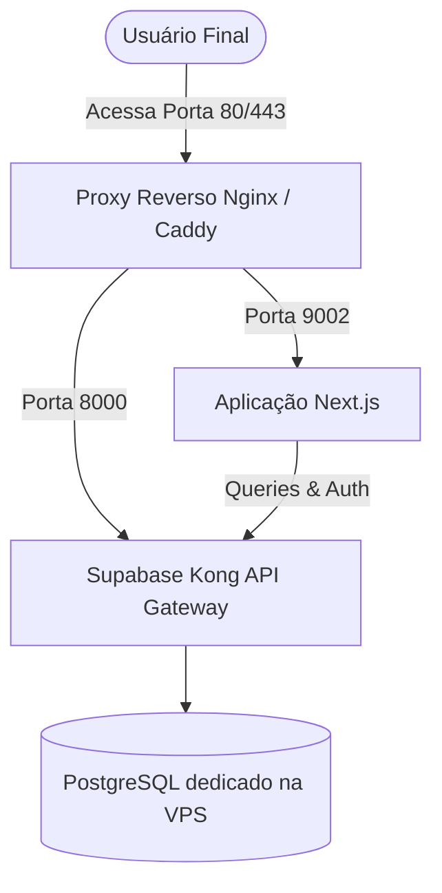

# Plano de Migração para VPS: Next.js + Supabase Self-Hosted

Este documento apresenta um guia passo a passo completo para migrar todo o seu ecossistema (Aplicação Next.js e Banco de Dados) do Supabase Cloud para uma VPS própria (ex: DigitalOcean, Hetzner, AWS, Linode).

> [!NOTE]
> **Por que Autohospedar o Supabase com Docker na VPS?**
> - **Zero alterações de código:** Você continuará usando o SDK do Supabase normalmente no arquivo [supabase.ts](file:///i:/programacao/resttest/src/lib/supabase.ts).
> - **Custo Fixo e Recursos Dedicados:** Sem limites de conexões simultâneas, tamanho de banco (500MB gratuitos) ou cobranças adicionais por tráfego/egress.
> - **Controle Total:** Você decide o tamanho da CPU, Memória RAM e SSD que seu banco de dados precisa.

---

## 📋 Visão Geral da Arquitetura na VPS



---

## 🛠️ Passo a Passo da Migração

### Passo 1: Fazer o Backup do Banco de Dados Atual (Supabase Cloud)

Como o `pg_dump` não vem instalado por padrão no Windows, a forma **mais fácil e rápida** é rodar esse comando **diretamente de dentro da sua VPS** (que usa Linux). Isso também poupa você de ter que baixar o arquivo no seu computador para depois enviá-lo à VPS!

1. Conecte-se na sua VPS via SSH.
2. Como o Supabase Cloud está rodando uma versão recente do PostgreSQL (v17), você precisa instalar o cliente específico do PostgreSQL v17 para evitar erros de versão incompatível. Execute os comandos abaixo para adicionar o repositório oficial e instalar a versão correta:
   ```bash
   # Adicionar repositório oficial do PostgreSQL no Ubuntu
   sudo install -d /etc/apt/keyrings
   curl -fsSL https://www.postgresql.org/media/keys/ACCC4CF8.asc | sudo gpg --dearmor -o /etc/apt/keyrings/postgresql.gpg
   echo "deb [signed-by=/etc/apt/keyrings/postgresql.gpg] http://apt.postgresql.org/pub/repos/apt $(lsb_release -cs)-pgdg main" | sudo tee /etc/apt/sources.list.d/pgdg.list

   # Atualizar e instalar o cliente do Postgres 17
   sudo apt update
   sudo apt install postgresql-client-17 -y
   ```
4. Execute o comando abaixo **na sua VPS** para gerar o arquivo de backup completo em formato de texto puro (`.sql`) diretamente nela:
   ```bash
   pg_dump -h db.zzbxhgqjasddlrpyrnvo.supabase.co -U postgres -d postgres -f /root/supabase_backup.sql
   ```
   *Substitua o host `db.zzbxhgqjasddlrpyrnvo.supabase.co` pelos dados reais do seu projeto do Supabase Cloud (se aplicável).*

---

### Passo 2: Preparar a VPS (Servidor Linux Ubuntu)

Após contratar sua VPS (mínimo recomendado: **2 vCPUs e 4GB de RAM** devido ao peso da stack completa do Supabase), conecte-se via SSH e instale os pacotes básicos:

```bash
# Atualizar o sistema
sudo apt update && sudo apt upgrade -y

# Remover pacotes antigos/conflitantes (se houver)
sudo apt remove docker.io containerd -y

# Instalar Docker usando o Script Oficial (evita conflitos de dependências e instala a versão mais recente)
curl -fsSL https://get.docker.com | sudo sh

# Ativar o serviço do Docker
sudo systemctl enable --now docker

# Garantir que o Git está instalado
sudo apt install git -y
```

---

### Passo 3: Configurar o Supabase Self-Hosted na VPS

O próprio Supabase disponibiliza uma receita oficial para rodar toda a stack via Docker Compose.

1. Clone o repositório de configuração oficial na sua VPS:
   ```bash
   git clone --depth 1 https://github.com/supabase/supabase.git
   cd supabase/docker
   ```

2. Copie o arquivo de exemplo de variáveis de ambiente:
   ```bash
   cp .env.example .env
   ```

3. **Gerar as Chaves de Segurança JWT:**
   Você precisará de novas chaves seguras (JWT Secret, Anon Key e Service Key). Você pode gerá-las localmente ou usar geradores online seguros. 
   Configure essas chaves dentro do arquivo `.env` gerado na VPS:
   - `POSTGRES_PASSWORD`: Defina uma senha mestre forte para o banco de dados.
   - `JWT_SECRET`: Uma string aleatória forte com pelo menos 32 caracteres.
   - `ANON_KEY` e `SERVICE_ROLE_KEY`: Gerados com base no seu `JWT_SECRET`.

4. Suba a stack do Supabase na VPS:
   ```bash
   docker compose up -d
   ```
   *Isso iniciará o PostgreSQL, PostgREST, Auth (GoTrue), Realtime, Storage e Kong API Gateway.*

---

### Passo 4: Restaurar os Dados na VPS

Como o banco local roda dentro de um container Docker Postgres, a forma mais segura e compatível de restaurar (evitando erros de portas e de versões do PostgreSQL) é copiar o arquivo de texto simples `.sql` para dentro do container e rodar a restauração via `psql`:

1. Copie o arquivo de backup `.sql` da VPS para dentro do container do banco de dados (`supabase-db`):
   ```bash
   docker cp /root/supabase_backup.sql supabase-db:/tmp/supabase_backup.sql
   ```

2. Execute o comando `psql` dentro do container para importar todos os dados e tabelas:
   ```bash
   docker exec -it supabase-db psql -U postgres -d postgres -f /tmp/supabase_backup.sql
   ```

---

### Passo 5: Implantar a Aplicação Next.js na VPS

Você tem duas formas principais de colocar seu sistema Next.js para rodar na VPS:

#### Opção A: Usando PM2 (Recomendado para simplicidade)
1. Instale o Node.js e o PM2 na VPS:
   ```bash
   curl -fsSL https://deb.nodesource.com/setup_20.x | sudo -E bash -
   sudo apt install -y nodejs
   sudo npm install -g pm2
   ```
2. Clone o repositório do seu sistema `resttest` na VPS.
3. Crie e configure o arquivo [.env](file:///i:/programacao/resttest/.env) na pasta do projeto na VPS com os dados do seu Supabase Self-Hosted:
   ```env
   NEXT_PUBLIC_SUPABASE_URL=http://IP_DA_SUA_VPS:8000
   NEXT_PUBLIC_SUPABASE_ANON_KEY=NOVA_ANON_KEY_GERADA
   SUPABASE_SERVICE_ROLE_KEY=NOVA_SERVICE_KEY_GERADA
   ```
4. Instale as dependências e compile o sistema:
   ```bash
   npm install
   npm run build
   ```
5. Inicie a aplicação com o PM2 para que ela continue rodando em segundo plano:
   ```bash
   pm2 start npm --name "next-resttest" -- start
   pm2 save
   pm2 startup
   ```

#### Opção B: Dockerizar a Aplicação Next.js
Se preferir rodar tudo em Docker, você pode criar um `Dockerfile` na raiz do projeto e orquestrá-lo junto ou separado do Compose do Supabase.

---

### Passo 6: Configurar o Nginx como Proxy Reverso e SSL (HTTPS)

Para expor sua aplicação com segurança na internet usando seu domínio (ex: `meusistema.com`):

1. Instale o Nginx e Certbot:
   ```bash
   sudo apt install nginx certbot python3-certbot-nginx -y
   ```
2. Configure o Nginx (`/etc/nginx/sites-available/default`) para redirecionar o tráfego do domínio para a porta `9002` (Next.js):
   ```nginx
   server {
       server_name meusistema.com;

       location / {
           proxy_pass http://127.0.0.1:9002;
           proxy_http_version 1.1;
           proxy_set_header Upgrade $http_upgrade;
           proxy_set_header Connection 'upgrade';
           proxy_set_header Host $host;
           proxy_cache_bypass $http_upgrade;
       }
   }
   ```
3. Ative o SSL gratuito da Let's Encrypt:
   ```bash
   sudo certbot --nginx -d meusistema.com
   ```

---

## 🎯 Resumo dos Próximos Passos

1. **Definir a infraestrutura:** Escolher o provedor de VPS (DigitalOcean, Hetzner, etc).
2. **Realizar o backup** do Supabase atual.
3. **Instalar Docker** e levantar a stack do Supabase na VPS.
4. **Restaurar os dados**.
5. **Configurar o Next.js** na VPS apontando para o endereço local.
